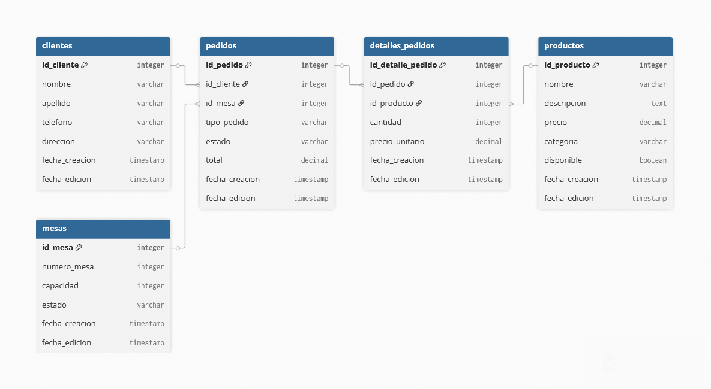

# Sistema de Gestión "GustoDivino"

Este proyecto es un sistema de gestión integral (API REST) desarrollado con **Quarkus** y **Java 17** para el restaurante "Pasta e Basta". El objetivo es centralizar la información y automatizar los flujos de trabajo en sus tres áreas de servicio: comedor, pedidos para llevar y entregas a domicilio.

---

## 1. Procesos Principales del Sistema

El sistema "GustoDivino" gestiona los siguientes procesos clave que constituyen el núcleo de la operativa del restaurante:

*   **Gestión del Menú Digital:** Creación, actualización y consulta de todos los platos y bebidas que ofrece el restaurante.
*   **Procesamiento de Pedidos:** Manejo del ciclo de vida completo de una orden, desde su registro hasta su finalización y facturación.
*   **Administración de Clientes:** Registro y consulta de la información de los clientes para facilitar la toma de pedidos y personalizar el servicio.
*   **Gestión de Operaciones en Cocina:** Comunicación clara y ordenada de las comandas desde el área de servicio hacia la cocina.

---

## 2. Diagrama Entidad-Relación (DER)

El siguiente diagrama muestra la estructura de la base de datos, las entidades principales y sus relaciones.



---

## 3. Lista de Endpoints de la API

La API sigue las convenciones REST y se organiza en los siguientes recursos. Todos los endpoints operan con formato JSON.

### Productos (`/api/productos`)
| Método | Endpoint              | Acción                       |
| :----- | :-------------------- | :--------------------------- |
| `GET`    | `/api/productos`      | Listar todos los productos   |
| `GET`    | `/api/productos/{id}` | Obtener un producto por ID   |
| `POST`   | `/api/productos`      | Crear un nuevo producto      |
| `PUT`    | `/api/productos/{id}` | Actualizar un producto       |
| `DELETE` | `/api/productos/{id}` | Eliminar un producto         |

### Clientes (`/api/clientes`)
| Método | Endpoint            | Acción                     |
| :----- | :------------------ | :------------------------- |
| `GET`    | `/api/clientes`     | Listar todos los clientes  |
| `GET`    | `/api/clientes/{id}`| Obtener un cliente por ID  |
| `POST`   | `/api/clientes`     | Crear un nuevo cliente     |
| `PUT`    | `/api/clientes/{id}`| Actualizar un cliente      |
| `DELETE` | `/api/clientes/{id}`| Eliminar un cliente        |

### Mesas (`/api/mesas`)
| Método | Endpoint          | Acción                   |
| :----- | :---------------- | :----------------------- |
| `GET`    | `/api/mesas`      | Listar todas las mesas   |
| `GET`    | `/api/mesas/{id}` | Obtener una mesa por ID  |
| `POST`   | `/api/mesas`      | Crear una nueva mesa     |
| `PUT`    | `/api/mesas/{id}` | Actualizar una mesa      |
| `DELETE` | `/api/mesas/{id}` | Eliminar una mesa        |

### Pedidos (`/api/pedidos`)
| Método | Endpoint                                | Acción                                  |
| :----- | :-------------------------------------- | :-------------------------------------- |
| `GET`    | `/api/pedidos`                          | Listar todos los pedidos                |
| `GET`    | `/api/pedidos/{id}`                     | Obtener un pedido completo por ID       |
| `POST`   | `/api/pedidos`                          | Crear un nuevo pedido completo          |
| `PUT`    | `/api/pedidos/{id}`                     | Actualizar un pedido completo           |
| `DELETE` | `/api/pedidos/{id}`                     | Eliminar un pedido                      |
| `POST`   | `/api/pedidos/{id}/detalles`            | Añadir un nuevo producto a un pedido    |
| `PUT`    | `/api/pedidos/{id}/detalles/{detalleId}`| Actualizar un detalle de un pedido      |
| `DELETE` | `/api/pedidos/{id}/detalles/{detalleId}`| Quitar un producto de un pedido         |

---

## 4. Cómo Ejecutar y Probar el Proyecto

### Prerrequisitos
*   Java 17 (gestionado con SDKMAN!)
*   Maven 3.8+
*   Docker y Docker Desktop

### Pasos para la Ejecución
1.  **Levantar la base de datos (PostgreSQL):**
    ```bash
    docker run --name gustodivino-db -e POSTGRES_USER=gustouser -e POSTGRES_PASSWORD=gustopass -e POSTGRES_DB=gustodivino_db -p 5432:5432 -d postgres:15
    ```

2.  **Ejecutar la aplicación Quarkus en modo desarrollo:**
    ```bash
    mvn quarkus:dev
    ```

3.  **Acceder a la Documentación y Pruebas de la API (Swagger UI):**
    Una vez que la aplicación esté corriendo, abre tu navegador en la siguiente dirección:
    [http://localhost:8080/q/swagger-ui](http://localhost:8080/q/swagger-ui)